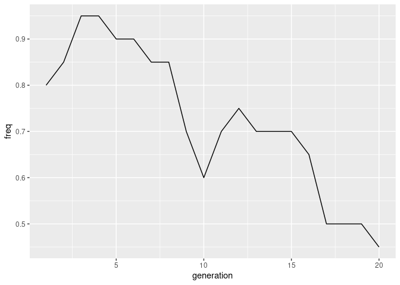
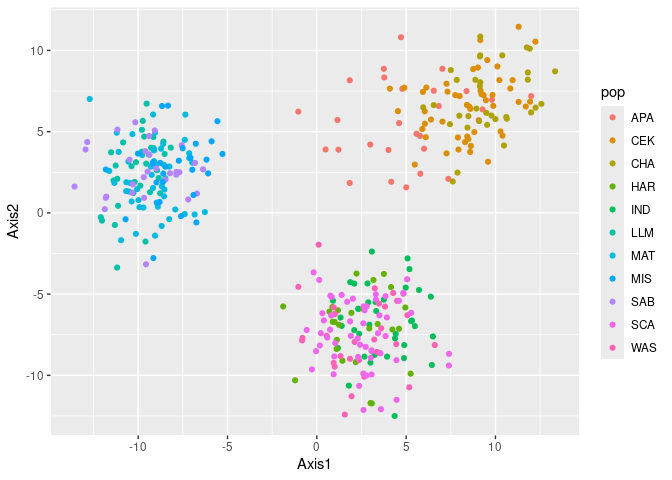
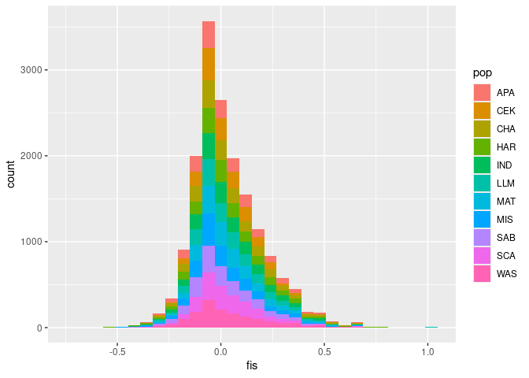

# {popgendata}

Datasets for teaching and testing population genetics workflows

## Installation

``` r
remotes::install_github("chollenbeck/popgendata")
```

## Example usage

Load an example simulation dataset in genind format

``` r
library(popgendata)
library(pantomime)
```

    ## Registered S3 method overwritten by 'pegas':
    ##   method      from
    ##   print.amova ade4

``` r
twentygen <- popgendata::twentygen
```

Plot the trajectory of an allele over 20 generations

``` r
twentygen %>%
  get_allele_freqs() %>% # From pantomime
  mutate(generation = as.integer(pop)) %>%
  filter(locus == "SNP_1", allele == "G") %>%
  ggplot(aes(x = generation, y = freq)) +
    geom_line()
```

<!-- -->

# Larger datasets

``` r
data("reddrum")

gen <- reddrum$geno
```

Run a quick PCA of the data

``` r
pca_tbl <- qpca(gen)

ggplot(pca_tbl, aes(x = Axis1, y = Axis2, col = pop)) +
  geom_point()
```

<!-- -->

Calculate stats by locus and pop and Plot `F_{IS}`:

``` r
stats <- get_locus_stats(gen)

stats
```

    ## # A tibble: 16,929 × 9
    ##    locus        pop   n_alleles prop_missing    maf    ho    he     fis hwe_pval
    ##    <chr>        <chr>     <int>        <dbl>  <dbl> <dbl> <dbl>   <dbl> <lgl>   
    ##  1 Contig_10008 APA           3       0      0      0.107 0.104 -0.0253 NA      
    ##  2 Contig_10013 APA           3       0.0714 0.0769 0.538 0.469 -0.148  NA      
    ##  3 Contig_10030 APA           2       0      0.214  0.357 0.343 -0.0425 NA      
    ##  4 Contig_1003… APA           2       0      0.179  0.357 0.298 -0.2    NA      
    ##  5 Contig_10045 APA           6       0      0      0.607 0.759  0.200  NA      
    ##  6 Contig_1006… APA           2       0      0.429  0.5   0.499 -0.0027 NA      
    ##  7 Contig_1007… APA           9       0      0      0.714 0.679 -0.0526 NA      
    ##  8 Contig_10089 APA           2       0      0.0536 0.107 0.103 -0.0385 NA      
    ##  9 Contig_1012… APA           2       0.0357 0.315  0.482 0.439 -0.0974 NA      
    ## 10 Contig_10127 APA           2       0      0.0893 0.179 0.165 -0.08   NA      
    ## # ℹ 16,919 more rows

``` r
ggplot(stats, aes(x = fis, fill = pop)) +
  geom_histogram()
```

    ## `stat_bin()` using `bins = 30`. Pick better value with `binwidth`.

    ## Warning: Removed 94 rows containing non-finite outside the scale range
    ## (`stat_bin()`).

<!-- -->
